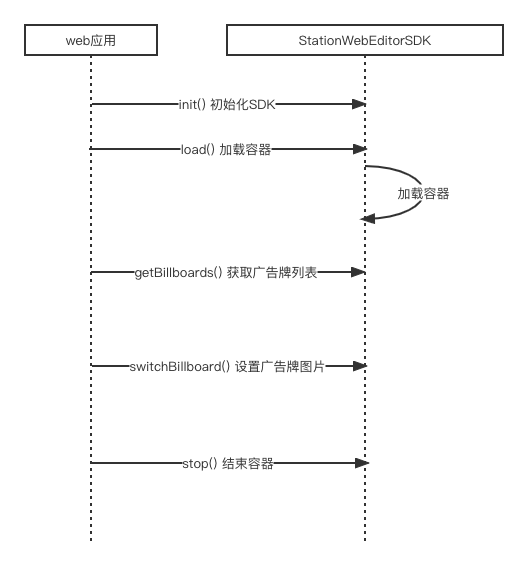

# Station Web Editor SDK

## 构建

```bash
# clone the project
git clone https://github.com/CrossEevery/station-web-editor-sdk.git

# enter the project directory
cd station-web-editor-sdk

# install dependency
npm install

# develop
npm run dev

# build for production environment
npm run build
```

## 流程说明



## 使用方法

### 1. 引入方式

import 方式引入

```javascript
import StationWebEditorSDK from 'station-web-editor-sdk';
```

或 script 标签引入

```javascript
<script type="text/javascript" src="./station-web-editor-sdk.js"></script>
```

### 2. 详细方法

- 初始化 SDK

  ```javascript
  StationWebEditorSDK.init({
    uuid: '',
    ticket: '',
    stationId: 0, // 空间站id
    mount: 'station-editor', // 加载节点
    api: '', // api地址
  });
  ```

  参数说明：

  | 字段名    | 类型   | 说明         |
  | --------- | ------ | ------------ |
  | uuid      | string | 用户 uuid    |
  | ticket    | string | 用户 ticket  |
  | stationId | number | 空间站 id    |
  | mount     | string | 页面加载元素 |
  | api       | string | 后端接口地址 |

- 加载容器

  ```javascript
  StationWebEditorSDK.load();
  ```

- 获取游戏中的广告牌列表(最佳方式是在 load 成功后 10s 左右再去获取广告牌，否则有可能会拿到空数据)

  ```javascript
  StationWebEditorSDK.getBillboards();
  ```

  返回说明：

  | 字段名 | 类型   | 说明       |
  | ------ | ------ | ---------- |
  | Name   | string | 广告牌编号 |

- 在游戏中设置广告牌
  这个方法可以在游戏中设置广告牌上显示图片并且切换到广告牌正面视角

  ```javascript
  StationWebEditorSDK.switchBillboard(Name, path);
  ```

  参数说明：

  | 字段名 | 类型   | 说明             |
  | ------ | ------ | ---------------- |
  | Name   | string | 广告牌编号       |
  | path   | string | 可访问的图片地址 |

- 结束界面

  ```javascript
  StationWebEditorSDK.stop();
  ```

### 3.后端 api 使用

如需广告牌可持久化显示，需要从调用后端 api 保存和获取广告牌信息

- 将广告位信息保存在数据库中

  ```javascript
  StationWebEditorSDK.stationApi.saveBillboard(object); // 保存广告牌信息
  ```

  object 参数说明：

  | 字段名           | 类型   | 说明                               |
  | ---------------- | ------ | ---------------------------------- |
  | ticket           | string | 用户 ticket                        |
  | token            | string | 用户 token，与 ticket 值 字段相同  |
  | uuid             | string | 用户 uuid                          |
  | slotCode         | string | 广告牌编号                         |
  | stationId        | number | 空间站 id                          |
  | elementStationId | number | 元素空间站 id，值与 stationId 相同 |
  | path             | string | 图片地址                           |

  返回数据：

  | 字段名  |                  | 类型   | 说明          |
  | ------- | ---------------- | ------ | ------------- |
  | code    |                  | number |
  | message |                  | string |
  | data    |                  | object |
  |         | id               | string | 广告位 id     |
  |         | uuid             | string | 用户 uuid     |
  |         | code             | string |               |
  |         | slotCode         | string | 广告牌编号    |
  |         | stationId        | number | 空间站 id     |
  |         | elementStationId | number | 元素空间站 id |
  |         | path             | string | 图片地址      |
  |         | status           | number | 状态 1-正常   |

- 获取空间站中已经设置好的广告牌列表

  ```
  StationWebEditorSDK.stationApi.getBillboardList(object); // 获取已设置的广告牌列表信息
  ```

  object 参数说明：

  | 字段名    | 类型   | 说明        |
  | --------- | ------ | ----------- |
  | ticket    | string | 用户 ticket |
  | uuid      | string | 用户 uuid   |
  | stationid | number | 空间站 id   |

  返回数据：

  | 字段名  |                  | 类型   | 说明          |
  | ------- | ---------------- | ------ | ------------- |
  | code    |                  | number |
  | message |                  | string |
  | data    |                  | array  |
  |         | id               | string | 广告位 id     |
  |         | uuid             | string | 用户 uuid     |
  |         | code             | string |               |
  |         | slotCode         | string | 广告牌编号    |
  |         | stationId        | number | 空间站 id     |
  |         | elementStationId | number | 元素空间站 id |
  |         | path             | string | 图片地址      |
  |         | status           | number | 状态 1-正常   |
